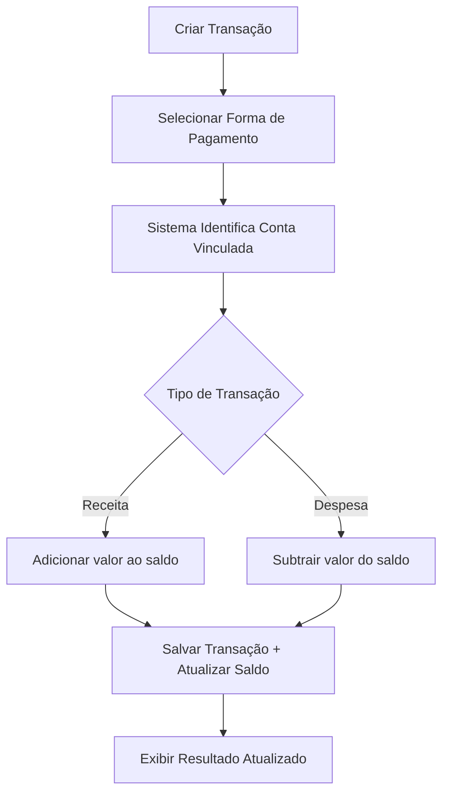

# Sistema de Formas de Pagamento - Aurum

## 📋 Funcionalidades Implementadas

### 🔧 **1. Gestão de Formas de Pagamento**
- ✅ **CRUD Completo**: Criar, visualizar, editar e deletar formas de pagamento
- ✅ **Vinculação com Contas**: Cada forma de pagamento é vinculada a uma conta específica
- ✅ **Tipos de Pagamento Suportados**:
  - PIX
  - Dinheiro (Cash)
  - Cartão de Crédito
  - Cartão de Débito
  - Transferência Bancária
  - Outros

### 💰 **2. Movimentação Automática de Saldo**
- ✅ **Integração com Transações**: Ao criar uma transação, o saldo da conta vinculada é automaticamente atualizado
- ✅ **Operações Suportadas**:
  - **Receitas**: Aumentam o saldo da conta
  - **Despesas**: Diminuem o saldo da conta
- ✅ **Cálculo Automático**: O sistema calcula automaticamente qual conta será afetada baseado na forma de pagamento selecionada

### 🎨 **3. Interface Moderna**
- ✅ **Seletor Inteligente**: Componente dropdown com preview das contas e saldos
- ✅ **Ícones Personalizáveis**: Cada forma de pagamento pode ter seu ícone e cor
- ✅ **Agrupamento por Conta**: As formas de pagamento são agrupadas por conta no seletor
- ✅ **Preview em Tempo Real**: Visualização instantânea durante a criação/edição

### 📊 **4. Dashboard e Estatísticas**
- ✅ **Métricas por Tipo**: Contadores de PIX, cartões, dinheiro, etc.
- ✅ **Informações da Conta**: Exibição do saldo atual da conta vinculada
- ✅ **Status Visual**: Indicadores coloridos para fácil identificação

## 🗂️ **Estrutura de Arquivos**

```
src/
├── components/
│   ├── payment-methods/
│   │   ├── payment-methods-page.tsx      # Página principal de gestão
│   │   ├── payment-method-modal.tsx      # Modal para criar/editar
│   │   ├── delete-payment-method-modal.tsx # Modal de confirmação de exclusão
│   │   └── payment-method-selector.tsx   # Seletor para usar em transações
│   └── transaction-form.tsx              # Formulário atualizado com seletor
├── types/
│   └── accounts.ts                       # Tipos e interfaces atualizados
└── contexts/
    └── accounts-context.tsx              # Context com funcionalidades de pagamento
```

## 🚀 **Como Usar**

### **1. Configurar Formas de Pagamento**
1. Acesse "Formas de Pagamento" no menu lateral
2. Clique em "Nova Forma de Pagamento"
3. Preencha as informações:
   - Nome (ex: "PIX Nubank")
   - Tipo de pagamento
   - Conta vinculada
   - Ícone e cor personalizados
4. Clique em "Adicionar"

### **2. Usar em Transações**
1. Ao criar uma nova transação
2. Preencha os dados normais (valor, descrição, categoria, data)
3. **Selecione a forma de pagamento** no novo campo
4. O sistema automaticamente:
   - Identifica a conta vinculada
   - Atualiza o saldo baseado no tipo (receita/despesa)
   - Registra a transação com a forma de pagamento

### **3. Monitorar Saldos**
- Os saldos das contas são atualizados em tempo real
- Visualize no dashboard de contas
- Acompanhe as movimentações por forma de pagamento

## 🔄 **Fluxo de Movimentação**



## 🛠️ **Tecnologias Utilizadas**
- **React 18** com TypeScript
- **Next.js 14** (App Router)
- **Lucide React** para ícones
- **Tailwind CSS** para estilização
- **Context API** para gerenciamento de estado
- **Supabase** para persistência (com fallback localStorage)

## 📱 **Responsividade**
- ✅ Desktop completo
- ✅ Tablet otimizado
- ✅ Mobile responsivo
- ✅ Touch-friendly

## 🔐 **Segurança e Validação**
- ✅ Validação de campos obrigatórios
- ✅ Verificação de conta vinculada
- ✅ Confirmação antes de deletar
- ✅ Tratamento de erros
- ✅ Feedback visual para ações

## 🎯 **Próximos Passos**
- [ ] Integração com cartões específicos
- [ ] Histórico de transações por forma de pagamento
- [ ] Relatórios por método de pagamento
- [ ] Limites e alertas por forma de pagamento
- [ ] Sincronização com APIs bancárias

---

**Sistema completamente funcional e pronto para uso! 🎉**
